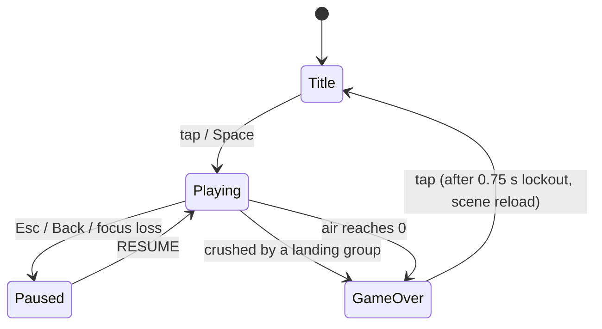
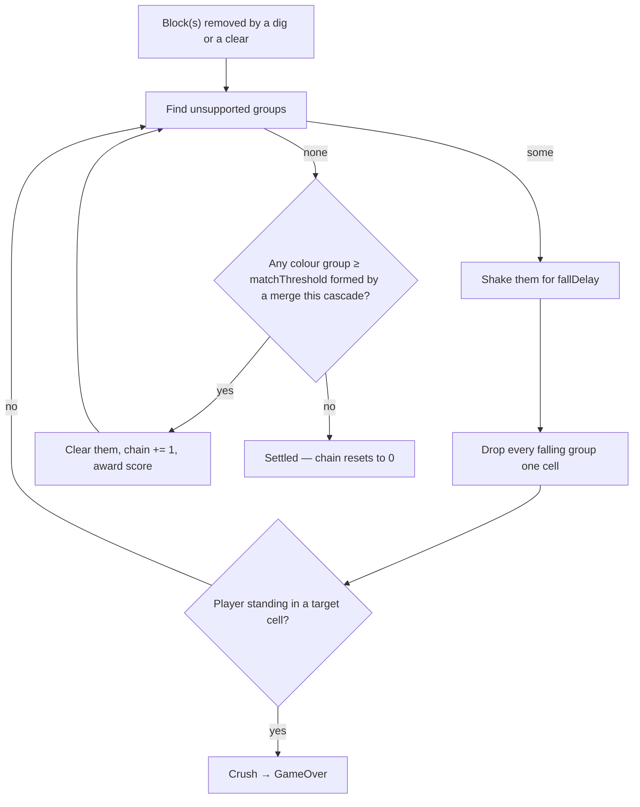
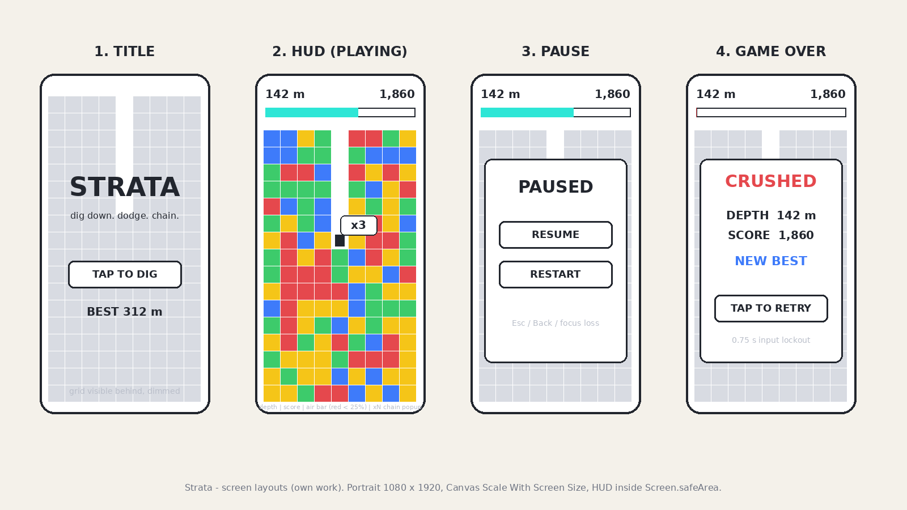
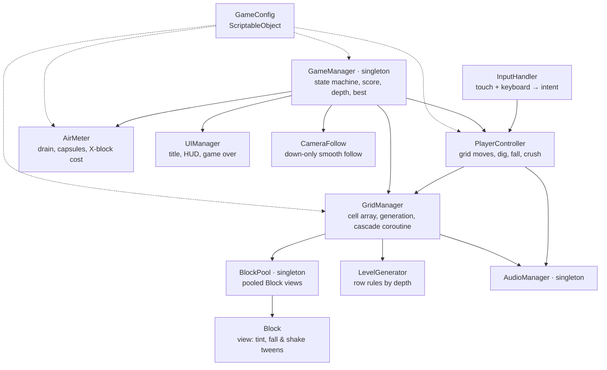

# Game Design Document — *Strata*

| | |
|---|---|
| **Working title** | Strata — a take on *Digger* (1983) with *Mr. Driller*'s colour-group rules |
| **Team** | Doron, Aviv (both: design, code, build) |
| **Genre** | Arcade / endless vertical digger / score-chaser |
| **Target platform** | Windows standalone + Android APK — one project, portrait on both (PC letterboxed). Developed in the Windows Editor + Device Simulator |
| **Engine / Unity version** | Unity 6.3 LTS (6000.3.20f1), Built-In Render Pipeline, 2D |
| **Orientation & reference resolution** | Portrait, 1080 × 1920 reference; 9-column grid, 1 block = 1 world unit = 120 px |
| **Expected session length** | 30 seconds – 4 minutes |
| **Document version** | v0.3 — 2026-09-17 |

---

## 1. High Concept

A digger stands on an endless column of coloured blocks. Tap left, right or down to step or dig; a dig removes the whole connected colour group. Unsupported groups shake, then drop as one; a landed group of four-plus clears and chains. Air drains constantly; capsules refill it. Crushed or out of air, the run ends. Score: depth plus chains.

### Design pillars

1. **Every crush is telegraphed** — a group never falls the instant it loses support: it shakes in place for `fallDelay`, then drops one cell at a time. Every death is a dodge the player failed to make. Rules out: random rockfalls, off-screen threats, instant drops, anything that hits from the side.
2. **One grid, one truth** — player, blocks, digging, falling and crushing are all integer cell logic on a single 2D array. Rules out: Rigidbody2D, colliders, half-cell positions, jumping, fall damage.
3. **Chains are the score** — depth is the baseline, but real points come from dropping groups into four-plus merges and cascading them. Rules out: enemies, weapons, power-ups other than air capsules, lives.

---

## 2. Reference & Inspiration

- **Primary reference (rules):** *Mr. Driller* (Namco, 1999). Taking: colour-group digging, group-fall with hang time, four-plus clear on merge, air meter with capsules, X-blocks that cost air. Not taking: lives and continues, fixed levels and goals, character roster.
- **Primary reference (classic):** *Digger* (Windmill Software, 1983) / *Boulder Dash* (1984). Taking: the one-screen "something above me is about to fall" tension and cell-based digging. Not taking: enemies, gems, horizontal levels.
- **Feel reference:** [Make it Juicy](https://lonebot.itch.io/make-it-juicy) (Lonebot, shared by the course instructor) — the feedback bar this project aims for: the same simple base, transformed by feedback.
- **Pages:** [Mr. Driller on Wikipedia](https://en.wikipedia.org/wiki/Mr._Driller_(video_game)) · [MobyGames entry](https://www.mobygames.com/game/4348?s=platform) (rules, X-blocks, air). For the feel, the first 30 s of any "Mr. Driller arcade longplay" on YouTube shows the hang-time and a chain.

**What we do differently:** endless vertical descent with procedural rows instead of fixed levels; one life; a score multiplier tied to chain length; chunky programmer-art blocks with heavy juice instead of characters.

---

## 3. Core Game Loop

The grid runs its own cascade while the player keeps moving — dodging a shaking group is the core skill:

**Moment-to-moment rules**

- The player occupies exactly one cell. A step or dig is a `moveDuration` tween; input arriving mid-tween is buffered (one slot) and executed on arrival.
- Left/right: if the target cell is empty, step into it; if it holds a block, dig it (the player stays put). Down: dig the block under the player, then fall into the gap. There is no dig-up.
- **A dig removes the whole 4-neighbour connected group of that colour, not one block.** This is the line that makes the game — a single-block dig is *Digger*, a group dig is *Strata*.
- X-blocks and air capsules are never part of a colour group. An X-block dig removes one block and costs `xBlockAirCost`. A capsule is collected by digging it and restores `airCapsuleRestore`.
- **Support:** a colour group is supported if *any* of its blocks has a block directly beneath it. The player is not support. Below the generated rows counts as solid. An unsupported group shakes for `fallDelay`, then drops one cell per `fallDurationPerCell`, and is re-checked after every cell so it can land on another falling group.
- **Crush:** a dropping group whose next cell is the player's cell ends the run. Groups only move straight down, so nothing ever hits from the side.
- **Player gravity:** if the cell under the player becomes empty (after a dig or a clear beneath them) the player falls immediately, one cell per `fallDurationPerCell`, ignoring input until landing. Landing never hurts.
- **Merge clear:** once every group has settled, a colour group of `matchThreshold` or more clears **only if it merged** — it is the union of two or more groups that existed before the drop. A big group that merely fell intact stays: pre-made clusters are dig targets, not free points. `chain` increments per clear pass and resets to 0 when the grid settles with nothing to clear.
- **Scoring:** `+depthScore` each time the player reaches a new deepest row; `+clearScore × chain` per block cleared. Digging itself scores nothing.
- **Air:** starts at 100 %, drains at `airDrainPerSecond` from the first input; capsule `+airCapsuleRestore`, X-block `−xBlockAirCost`. Air ≤ 0 → run ends.
- **Failure:** on crush or empty air the grid freezes, the cause is shown ("CRUSHED" / "OUT OF AIR"), input is locked for `gameOverLockout`, then any tap reloads the scene.
- **World:** 9 columns; input that would leave the grid is ignored. Rows are generated `bufferRows` below the camera and recycled once they are 2 rows above it.

### Parameters you will need to tune

| Parameter | What it controls | First guess |
|---|---|---|
| `gridWidth` | Columns; camera width is derived from it | 9 |
| `colorCount` | Number of block colours — the main difficulty dial (fewer = bigger groups, bigger chains, easier) | 4 |
| `matchThreshold` | Merged group size that clears | 4 |
| `fallDelay` | Hang time before an unsupported group drops — the fairness knob | 0.35 s |
| `fallDurationPerCell` | Fall speed, blocks and player | 0.08 s |
| `moveDuration` | Player step tween | 0.10 s |
| `digDuration` | Pause while digging (hides the group-removal pop) | 0.12 s |
| `airDrainPerSecond` | Base pressure; trades against capsule frequency | 1.5 %/s |
| `airCapsuleRestore` | | 20 % |
| `xBlockAirCost` | | 20 % |
| `capsuleEveryNRows` | Average rows between capsules | 12 |
| `xBlockChanceByDepth` | X-block density curve (AnimationCurve, depth → probability) | 0 % until 10 m, 3 % at 50 m, 10 % at 500 m |
| `bufferRows` | Rows kept generated below the camera edge | 12 |
| `depthScore` / `clearScore` | Points per new row / per cleared block (× chain) | 10 / 10 |
| `gameOverLockout` | | 0.75 s |

**Where these live:** one `GameConfig` ScriptableObject asset (`Assets/Config/GameConfig.asset`), referenced by `GameManager` and read by every system. No tuning value is a literal in a script.

**Feel target:** a first-time player reaches 50 m within three runs; a player with ten minutes on the game reaches 200 m and triggers at least one chain of 3 per run.

---

## 4. Controls & Input

| Action | Keyboard / Mouse | Gamepad | Touch |
|---|---|---|---|
| Step / dig left | `←` / `A`; click left of the player | — (out of scope) | tap left of the player |
| Step / dig right | `→` / `D`; click right of the player | — | tap right of the player |
| Dig down | `↓` / `S`; click below the player | — | tap below the player |
| Start / retry | `Space` / click | — | tap anywhere |
| Pause | `Esc` | — | Android **Back** button; auto-pause on focus loss |

- A tap/click is classified by its screen position relative to the player: if `|dx| > |dy|` it is horizontal (sign of `dx`), otherwise it is *down* when `dy < 0`; taps above the player do nothing. `Input.GetMouseButtonDown(0)` covers the mouse and the first touch on Android, so one code path serves both; the touch-only details (Back button, `Screen.safeArea`) sit under `#if UNITY_ANDROID`.
- Input is polled in `Update` and turned into an intent (`Left` / `Right` / `Down`). There is no physics, so nothing goes through `FixedUpdate` (and per the course rule, input is never read there). One intent is buffered while the player is mid-tween; a newer intent overwrites it.
- Taps over a UI button are swallowed by the EventSystem (`IsPointerOverGameObject`) and never reach the grid.
- During the game-over lockout all input is ignored; after it, any tap or `Space` restarts.
- `OnApplicationPause` / focus loss pauses the run — air drain and the cascade both stop — so a notification never costs a crush. Resume runs a 3-2-1 coroutine countdown (polish).

---

## 5. Screens & UI

1. **Title** — game name, "TAP TO DIG", best depth ("BEST 312 m"). Tap starts a run and the panel fades out; the grid is already visible behind it.
2. **HUD (Playing)** — top-left: depth in metres; top-right: score; full-width air bar under them, turning red below 25 %; a "×N" chain label pops near the player during a chain. Deliberately absent: lives, pause button (polish), timer, minimap.
3. **Game Over** — cause line ("CRUSHED" / "OUT OF AIR"), depth, score, best (with "NEW BEST" when beaten), "TAP TO RETRY". Appears 0.5 s after the death animation.
4. **Pause overlay** — translucent; RESUME / RESTART. Reached via `Esc`, Android Back, or focus loss.

- **Canvas setup:** Screen Space – Overlay, CanvasScaler *Scale With Screen Size*, reference 1080 × 1920, match 0.5. TextMeshPro for all text. HUD anchored inside `Screen.safeArea` so notches never cover the air bar.
- **Camera:** orthographic; `orthographicSize = (gridWidth / 2) / aspect` computed at start so the grid always fills the width on any phone. Taller phones simply see more rows.

---

## 6. Art & Audio

| Asset | Variants / frames | Source & licence | Use |
|---|---|---|---|
| Block | 1 sprite, tinted to 4 colours + grey X-block | Unity built-in `Square` sprite, `SpriteRenderer.color` | MVP |
| Air capsule | 1 | Unity built-in `Circle`, tinted cyan | MVP |
| Player | 1 idle (2-frame dig in polish) | Unity built-in `Square`, tinted (MVP) → Kenney *Puzzle Pack 2* sprite (polish) | MVP |
| Block art (polish) | 8-colour tile set | Kenney *Puzzle Pack 2*, CC0 — https://opengameart.org/content/puzzle-pack-2-795-assets (also on kenney.nl) | polish |
| Clear burst | Particle System, default material, pooled | Unity built-in | MVP |
| Font | 1 | TextMeshPro bundled LiberationSans (OFL); *Press Start 2P* (Google Fonts, OFL) in polish | MVP |
| SFX: dig, land, clear, crush | 4 clips | Kenney *Digital Audio* and *Impact Sounds* packs (kenney.nl, CC0) | MVP |
| SFX: capsule, chain step, game over | 3 clips | same packs | polish |
| Music | 1 loop or none | Kenney music packs (kenney.nl, CC0) | polish |

**Licence note:** everything is either shipped with Unity or CC0 from kenney.nl, so it can live in the public GitHub repo and in a store build without restriction; Kenney is credited in the README anyway. No Namco *Mr. Driller* art, names or sounds are used — the reference is the rule set, not the assets.

**Technical art rules:** Point (no filter) import, PPU 120 (1 block = 1 unit = 120 px at reference), single SpriteAtlas in polish. Sorting layers back → front: `Background` → `Blocks` → `Player` → `FX` → `UI`. No colliders anywhere on the grid.

**Juice spec (pillars 1 and 3):** the `fallDelay` shake *is* the telegraph — it is gameplay, not decoration, and ships first. Landing = squash on the group + a micro-shake scaled by group size + a thud. Clear = particle burst in the group's colour + one-frame white flash + shake tick; (polish) every chain step pitches the clear SFX up a semitone and the "×N" popup grows with N. Air below 25 % = bar pulses red with a heartbeat tick. Nothing on the grid ever disappears silently and statically.

---

## 7. Technical Design

**Scenes:** one, `Game.unity`. Restart reloads it (MVP); an in-place reset through the pool is a polish item.

**Packages / systems used:** 2D Sprite, TextMeshPro (UGUI), `UnityEngine.Pool.ObjectPool<T>`, Input Manager (legacy, as taught) with *Active Input Handling: Both*, Android Build Support (SDK/NDK/JDK via Hub), Device Simulator (Unity 6 Game view). No Physics2D.

**Target devices:** the dev Windows laptop (standalone build) and one Android phone, portrait, API 24+ (Android 7). Development in the Editor / Device Simulator; the APK is verified on a physical phone before submission. Pacing values (`airDrainPerSecond`, `fallDelay`) are identical on both platforms — difficulty never depends on the device.

**Architecture:**

| Script | Responsibility |
|---|---|
| `GameManager` | Singleton; `Title / Playing / Paused / GameOver` state machine, score, depth, best (PlayerPrefs) |
| `GameConfig` | ScriptableObject holding every tunable from §3 |
| `GridManager` | Owns `CellType[,]`, applies digs, runs the fall/merge cascade coroutine, asks the generator for rows |
| `LevelGenerator` | Produces one row at a time from depth-based rules (colours, X-block curve, capsule spacing) |
| `BlockPool` | Singleton object pool of `Block` views; rows are rented and returned, never instantiated during play |
| `Block` | One pooled view: tint by type, `FallTo()` and `Shake()` coroutines |
| `PlayerController` | Consumes intents, steps/digs, falls, reports crush; owns the one-slot input buffer |
| `InputHandler` | Turns taps and keys into a single `Intent` enum each frame |
| `AirMeter` | Drains air in `Update`, applies capsule/X-block deltas, raises `OnEmpty` |
| `CameraFollow` | Follows the player downward only, with smoothing; derives ortho size from `gridWidth` |
| `UIManager` | Three panels, HUD bindings; listens to `GameManager` events |
| `AudioManager` | Singleton; `Play(SfxId)` via `PlayOneShot`, optional music loop |

### The course features you are implementing

1. **Object pooling** (Session 6, Unity's `ObjectPool<T>`) — `BlockPool` wraps `ObjectPool<Block>`. The grid holds roughly 9 × 30 = 270 live blocks (visible rows plus buffer); every ~1.5 s of descent a new row is needed and an old one dies. `Instantiate` / `Destroy` of 9 GameObjects at that rate allocates and triggers GC (Session 8's lesson), and a GC hitch during `fallDelay` would be an unfair crush (pillar 1). Rows are rented and returned; the pool never grows after warm-up. Clear-burst particles and chain popups are pooled the same way.
2. **Coroutines** (Session 5) — `GridManager.CascadeRoutine()`, `Block.FallTo()`, `Block.Shake()`, the landing squash (Session 5's `Lerp` example), `GameManager.GameOverRoutine()` and the 3-2-1 resume. The cascade is a sequence with waits (shake → drop a cell → re-check → clear → repeat) that must not block the player's movement; a coroutine reads top-to-bottom exactly like the flowchart in §3, where `Update` flags would be a dozen booleans. The game-over lockout is a single `WaitForSeconds(gameOverLockout)`.
3. **Singletons** (Session 3 pattern, `Awake` guard) — `GameManager`, `BlockPool`, `AudioManager` (the last with `DontDestroyOnLoad` so music survives the restart reload). Exactly one of each exists and every other script needs them; a singleton accessor replaces `FindObjectOfType` calls and Inspector wiring across a dozen prefabs. Nothing else is a singleton — the player and grid are ordinary references owned by `GameManager`.
4. **ScriptableObjects** (Session 6) — `GameConfig`: every knob in §3 tunable without recompiling.
5. **PlayerPrefs** (Session 6) — best depth, best score, mute setting.
6. **UnityEvents / observer** (Sessions 3–4) — `OnStateChanged`, `OnScoreChanged`, `OnDepthChanged`, `OnChain`, `AirMeter.OnEmpty`; `UIManager` and `AudioManager` subscribe instead of polling.
7. **Mobile compilation** (Sessions 6–7) — Android `.apk`, IL2CPP + ARM64, `Application.targetFrameRate = 60`, package name `com.strata.game` from day one, portrait lock, touch path under `#if UNITY_ANDROID`, HUD inside `Screen.safeArea`, `OnApplicationPause` auto-pause. Built and run on a real phone before submission.
8. **Gizmos** (Session 6) — editor-only lines for the grid bounds, the recycle line above the camera, the generation line below it, and the player's buffered target cell.
9. **State machine** — `enum GameState { Title, Playing, Paused, GameOver }` in `GameManager` with one `SetState()` that fires `OnStateChanged` for UI and audio.

**Project & repo hygiene (Session 7's grading notes):** one public GitHub repo with the Unity `.gitignore` (`Library/`, `Temp/`, builds) plus agent configuration (`.claude/` etc.); third-party assets under `Assets/ThirdParty/`, own work under `Scripts / Prefabs / Scenes / Config / Art / Audio`. Two developers, so: feature branches merged through pull requests, everything is a prefab and `Game.unity` is edited by one person at a time (a `.unity` merge conflict is the one thing git cannot fix for us), and small commits with real messages across the whole project — not one push in week three.

---

## 8. Scope

### 8.1 MVP — the game is not a game without these

- [ ] `GameConfig` ScriptableObject with every §3 parameter
- [ ] Grid + procedural rows (4 colours, X-blocks, capsules) rented from `BlockPool`, recycled above the camera
- [ ] Player: tap/keyboard step & dig, colour-group removal, falling into gaps
- [ ] Cascade: support check, `fallDelay` shake, one-cell drops, landing, crush → game over
- [ ] Merge-4 clear with chain counter and score
- [ ] Air meter: drain, capsules, X-block cost, empty → game over
- [ ] Camera follow (down only)
- [ ] Title / HUD / Pause / Game Over panels, PlayerPrefs best depth and score
- [ ] Base juice: `fallDelay` shake, landing squash + micro-shake, pooled clear burst, SFX for dig / land / clear / crush
- [ ] Pause on `Esc` / Back / focus loss (`OnApplicationPause`)
- [ ] Windows standalone build **and** installable Android `.apk` at 60 fps

### 8.2 Polish — if the MVP is done and playable

- [ ] Extra juice: "×N" chain popup that grows with N, rising-pitch clear SFX per chain step, air-low heartbeat, one-frame white flash on clear
- [ ] Remaining SFX (capsule, chain, game over) + music loop through `AudioManager`, mute toggle
- [ ] 3-2-1 resume countdown after pause
- [ ] Hold-to-repeat input (`repeatInterval`)
- [ ] Depth milestones every 100 m: palette shift + banner
- [ ] Restart without scene reload (grid reset through the pool)
- [ ] Kenney sprites replacing programmer art; Press Start 2P font
- [ ] Android haptic tick on crush

### 8.3 Explicitly out of scope — we are **not** building these

- Enemies, weapons, projectiles, or any power-up other than air capsules
- Lives, continues, checkpoints — one life per run
- Levels, world select, story, character roster, unlocks
- Anything online: leaderboards, ads, analytics, cloud save
- Any save beyond PlayerPrefs best depth + best score
- iOS build, landscape orientation, gamepad support
- Physics2D — no Rigidbody, no colliders; all grid logic
- Digging upward, jumping, wall-climbing
- Localisation (English UI only)

---

## Changelog

| Version | Date | Change |
|---|---|---|
| v0.1 | 2026-09-16 | Initial draft |
| v0.2 | 2026-09-16 | Calibrated against two peer GDDs: Windows build added next to the APK; exact Unity version; base juice, pause and focus-loss handling moved into MVP (WOW is graded); course-feature list expanded to ObjectPool&lt;T&gt;, PlayerPrefs, UnityEvents, Gizmos and the mobile build details, each tied to the session that taught it; repo-hygiene section added; juice spec added to §6; Paused state added to the loop |
| v0.3 | 2026-09-17 | Submission version: concept mock and screen layouts added as own-work images; reference pages linked; no open placeholders |
